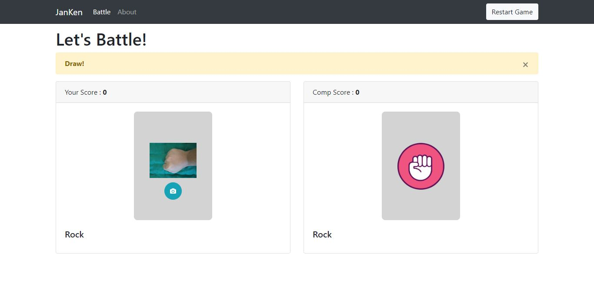
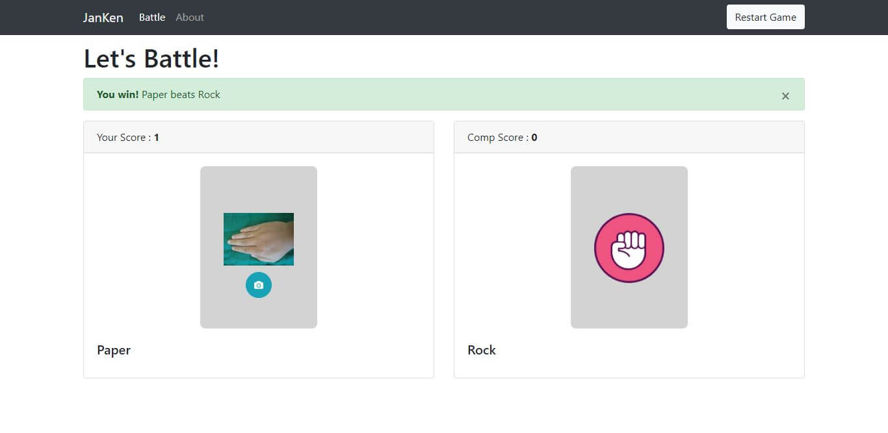
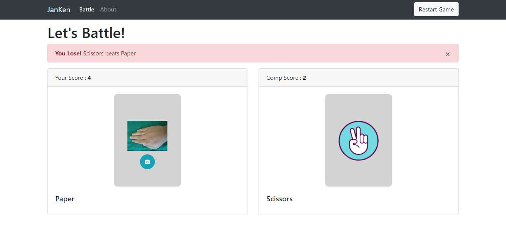

# JanKen App

This is a simple Janken game application, which uses the image classification feature. 

The image classification model is used to predict rock paper or scissors images,this [model](https://github.com/haris0/notebook_learning/blob/master/courses/dicoding_academy/CNN_Dicoding.ipynb) is the result of my final submission in the "Belajar Machine Learning untuk Pemula"

let's check the demo here [here](https://jk-apps.herokuapp.com/)

## Preview






## Installing Setup
Following this step to run the app :

- Clone this repo
- Create a virtual environment inside the folder
- Activate the virtual environment
- Installing all requirements library using this command 
  ```
  pip install -r requirements.txt
  ```
- And App is ready to running, hit this command
  ```
  flask run
  ```

## Libraries
Some of the main libraries that are used in this application :

- [Flask](https://flask.palletsprojects.com/)
- [Bootstrap4](https://getbootstrap.com/docs/4.5/components/card/)
- [Keras](https://keras.io/)